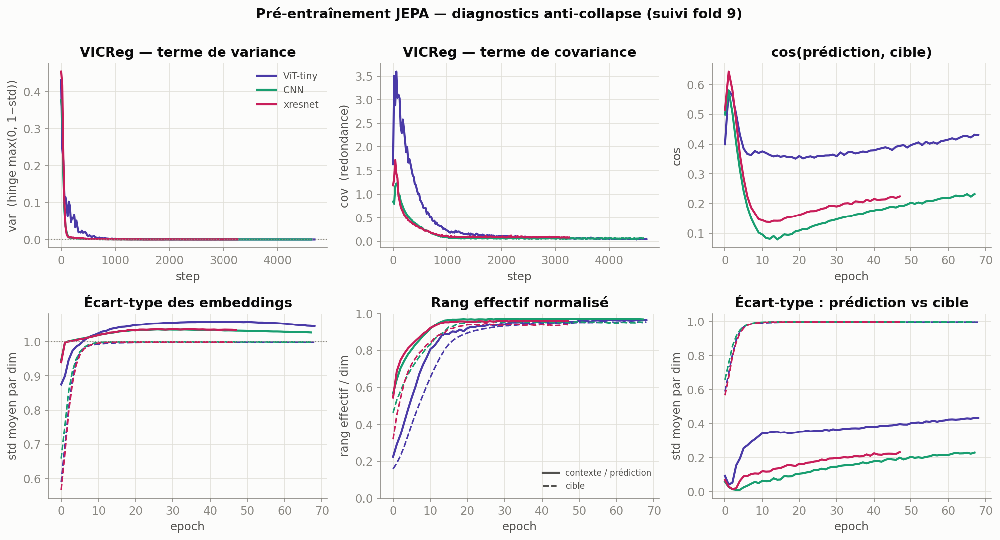
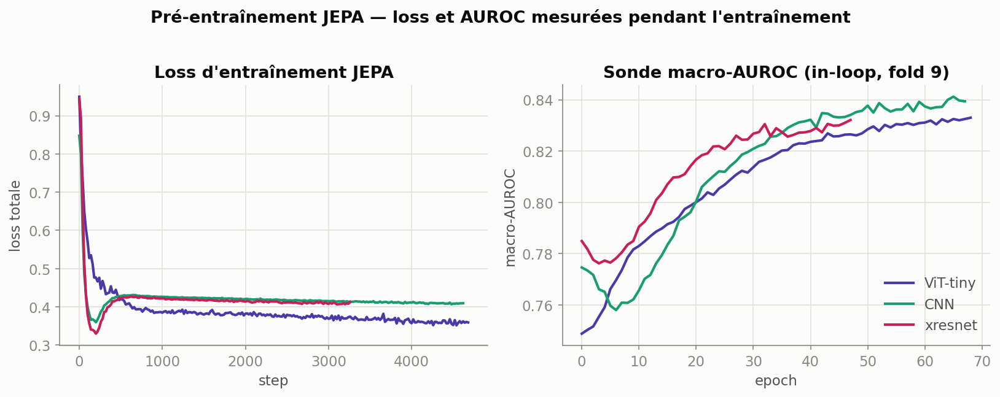
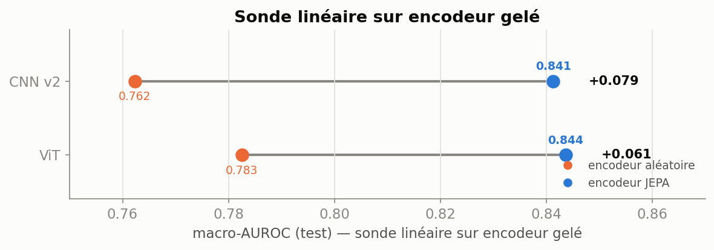
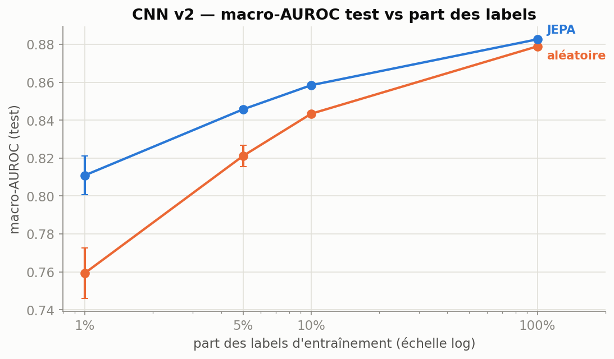
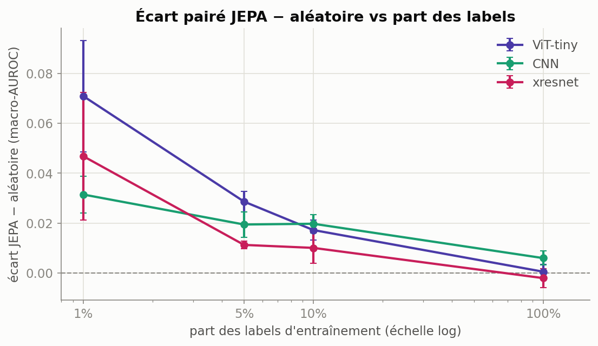
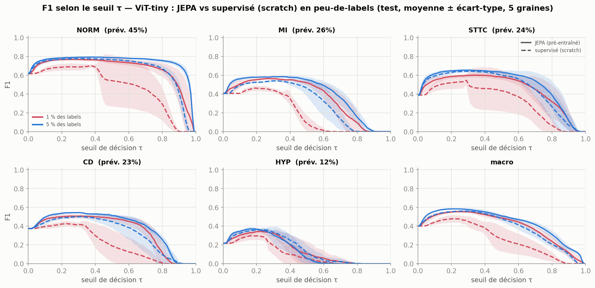
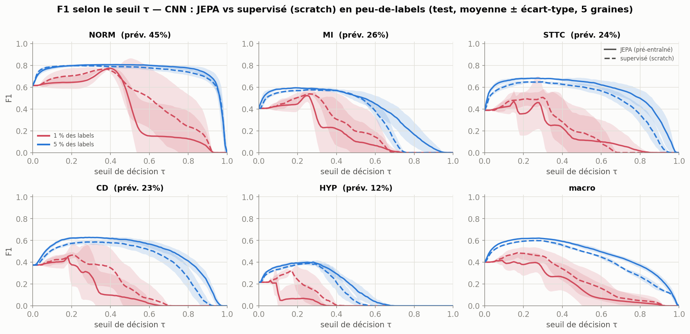
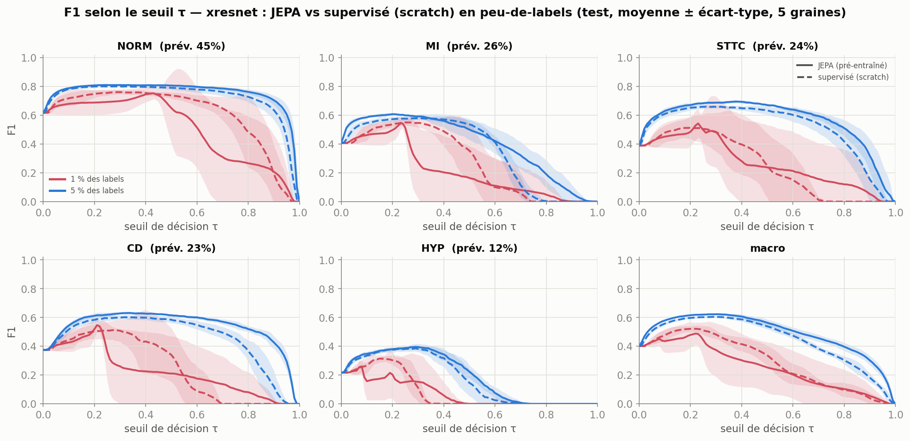
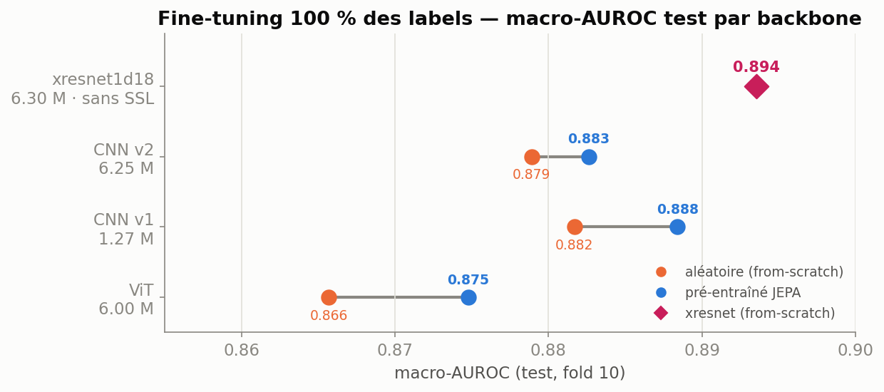
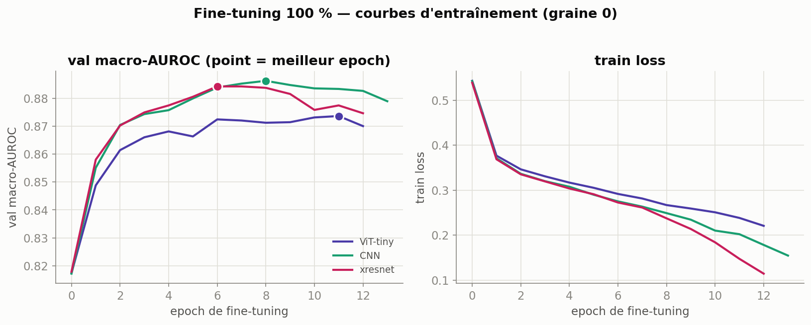

# Cardiac JEPA — auto-supervision par prédiction latente sur ECG (PTB-XL)

Un **JEPA** (Joint-Embedding Predictive Architecture) qui prédit les *embeddings* de zones
masquées d'un ECG — pas le signal en mV — puis un classifieur d'anomalies par-dessus. On mesure
ce que le pré-entraînement apporte, sur **trois familles de backbone à capacité égale** (~6 M),
et on le confronte à une baseline supervisée pure.

**Dataset.** PTB-XL — 21 837 ECG, 12 dérivations, 10 s, 100 Hz, 5 super-classes (NORM, MI, STTC,
CD, HYP), multi-label.

**Protocole unique** : pré-entraînement folds 1-8, sélection d'epoch sur
fold 9, **test sur le fold 10** (jamais vu). Chaque point d'évaluation est **répété sur 5 graines**
(3 pour la sonde), métriques **macro-AUROC + macro-AUPRC** avec
intervalles de confiance bootstrap. Baseline aléatoire toujours **iso-architecture**. Tous les
chiffres ci-dessous sont en **test / fold 10**, moyenne ± écart-type inter-graines.

---
## Quelques résultats

1. **Le JEPA apprend une représentation.** Sur encodeur **gelé**, une sonde linéaire gagne
   **+0,035 à +0,062** de macro-AUROC vs un encodeur aléatoire sans label d'entraînement.
2. **Le SSL aide surtout en peu-de-labels — et inégalement selon l'architecture.** En AUROC, l'écart JEPA−aléatoire décroît de **+0,07** (1 %) à **~0** (100 %). En décision (F1), le gain est fiable à 5 % sur les trois backbones ; à 1 %, **seul le ViT** en profite, les backbones convolutifs étant noyés dans la variance de graine.
3. **À pleine supervision, le JEPA n'apporte rien de significatif.** À titre de **comparaison** un xresnet1d supervisé de bout en bout (BatchNorm, ~6 M) atteint 0,897. Il diffère des bras JEPA par l'architecture **et** la normalisation (BN vs GroupNorm).

---

## 1 · Pré-entraînement sain



Grâce notamment à la normalisation VICReg, l'entraînement est stable et utilise bien les dimensions allouées. La loss cosinus montre que la prédiction remonte certainement légèrement vers la moyenne, sans conséquences puisque macro-AUROC continue d'augmenter.



La sonde in-loop (macro-AUROC sur fold 9, encodeur gelé) **monte de ~0,75 à ~0,84** au fil du
pré-entraînement, pendant que la loss JEPA descend : la représentation s'améliore réellement,
sans aucun label. **Cette figure permet de voir qu'il faut ajuster les réglages d'early stopping pour permettre d'atteindre la convergence macro-AUROC (en cours).**

## 2 · Sur features gelées, le SSL fonctionne



Encodeur gelé, sonde linéaire. Le pré-entraînement apporte un gain sur les trois
backbones.

| sonde linéaire (gelé) | aléatoire | JEPA | écart |
|---|---:|---:|---:|
| ViT-tiny | 0,7742 | **0,8363** | **+0,062** |
| CNN | 0,7813 | **0,8397** | **+0,058** |
| xresnet | 0,7976 | **0,8321** | **+0,035** |

## 3 · Peu-de-labels : ce que le pré-entraînement apporte

Le vrai intérêt du JEPA est là. On fine-tune chaque backbone sur 1 %, 5 %, 10 % puis 100 % des
labels, avec et sans pré-entraînement (même architecture, même norme).



En **AUROC**, le pré-entraînement fait gagner jusqu'à **+0,07** à 1 % ; l'écart rétrécit quand les
labels arrivent, et s'annule à 100 %.



| écart JEPA − aléatoire (AUROC) | 1 % | 5 % | 10 % | 100 % |
|---|---:|---:|---:|---:|
| ViT | +0,071 *(t 7,1)* | +0,029 *(t 16)* | +0,017 *(t 9,7)* | +0,001 *(ns)* |
| CNN | +0,031 *(t 9,6)* | +0,019 *(t 8,6)* | +0,020 *(t 12)* | +0,006 *(t 4,7)* |
| xresnet | +0,047 *(t 4,1)* | +0,011 *(t 16)* | +0,010 *(t 3,6)* | −0,002 *(ns)* |

*(t = statistique de Student sur l'écart pairé, 5 graines. ns = non significatif.)*

### En décision (F1), le gain dépend de l'architecture

L'AUROC mesure le **classement**, sans seuil. Pour la **décision**, on balaye le seuil τ et on lit
le **F1** — chaque backbone contre sa version supervisée de zéro (même archi), moyenne ± écart-type
sur 5 graines.





| F1-max macro (5 graines) | JEPA 1 % | scratch 1 % | JEPA 5 % | scratch 5 % |
|---|---:|---:|---:|---:|
| ViT | **0,558** ±0,010 | 0,481 ±0,039 | **0,589** | 0,562 |
| CNN | 0,451 ±0,062 | **0,493** ±0,044 | **0,623** | 0,601 |
| xresnet | 0,506 ±0,074 | **0,527** ±0,022 | **0,626** | 0,608 |

- **À 5 %, gain petit mais fiable sur les trois backbones**.
- **À 1 %, seul le ViT profite** (**+0,077**, et plus stable). Pour CNN et xresnet, le JEPA n'est
  **pas meilleur en F1**.
- Le SSL améliore donc le **classement** (AUROC) même à 1 %, mais pour les conv nets ça **ne se
  traduit pas en meilleure décision** (F1) : la calibration reste trop instable.


## 4 · Point de repère : où plafonne-t-on à 100 % des labels



À 100 % des labels (fine-tuné), les trois encodeurs JEPA (GroupNorm) plafonnent autour de
**0,87-0,88**, et le SSL n'y ajoute **rien de significatif**.

Pour situer ces chiffres, un **xresnet1d supervisé de bout en bout (BatchNorm, ~6 M) atteint 0,897**.

| plafond 100 % (fine-tuné) | aléatoire | JEPA |
|---|---:|---:|
| ViT-tiny | 0,8696 ±0,003 | 0,8701 ±0,002 |
| CNN | 0,8774 ±0,003 | **0,8833** ±0,000 |
| xresnet (GroupNorm) | 0,8833 ±0,003 | 0,8813 ±0,002 |
| *repère supervisé — xresnet (BatchNorm)* | *0,8974 ±0,001* | *—* |

## 5 · Le vrai frein : la généralisation



En fine-tuning, la val-AUROC **pique vers l'epoch 6-11 puis décline** pendant que la train-loss tend
vers 0 : **overfitting** sur 17 k ECG. Cela contribue certainement grandement au plafond des scores.

## Récapitulatif complet (macro-AUROC test)

| régime | ViT | CNN | xresnet (GN) | xresnet BN *(repère)* |
|---|---:|---:|---:|---:|
| Sonde gelée | 0,8363 | 0,8397 | 0,8321 | — |
| Fine-tuné 1 % | 0,7850 | 0,7987 | 0,8108 | 0,7865 |
| Fine-tuné 5 % | 0,8142 | 0,8431 | 0,8424 | 0,8477 |
| Fine-tuné 10 % | 0,8282 | 0,8542 | 0,8526 | 0,8631 |
| Fine-tuné 100 % | 0,8701 | **0,8833** | 0,8813 | **0,8974** |

*Trois premières colonnes : encodeurs JEPA (GroupNorm), bras SSL. Dernière colonne : **point de
repère** supervisé de zéro (BatchNorm, archi + norme différentes) — hors protocole de comparaison SSL.*


## Limites

- **Un seul pré-entraînement JEPA par backbone** (coût Colab). Les IC et les t inter-graines
  portent sur le fine-tuning / la sonde à **encodeur figé** ; ils **ne mesurent pas** la variance de
  pré-entraînement.
- Le **repère supervisé BatchNorm (0,897)** n'est **pas** une comparaison contrôlée du SSL : il
  change à la fois d'architecture et de norme et n'a pas de bras JEPA.
- Analyse par seuil (F1 vs τ) **balayée sur le test** : le « F1-max » est donc un **seuil-oracle**
  (borne supérieure de décision), et **aucun seuil validé ni calibration** clinique n'est fourni —
  les points de fonctionnement restent à choisir sur la validation.

---

## Reproduire

```bash
# Pré-entraînement JEPA (un backbone)
python -m jepa.train --config jepa/configs/{vit,cnn,xresnet}.yaml --out <bb>/pretrain

# Évaluation unifiée : sonde gelée, fine-tuning (early-stopping), supervisé BN
python -m jepa.eval --mode probe      --config jepa/configs/cnn.yaml --ckpt runs/cnn/pretrain/best.pt --out runs/cnn/jepa/probe/s0
python -m jepa.eval --mode finetune   --config jepa/configs/cnn.yaml --random-init --train-frac 0.05 --seed 0 --out runs/cnn/scratch/ft5/s0
python -m jepa.eval --mode supervised --config jepa/configs/xresnet_supervised.yaml --seed 0 --out runs/xresnet_bn/supervised/ft100/s0

# Toute la campagne (idempotent/reprenable), agrégation, figures
python -m jepa.experiment --steps pretrain,probe,finetune,supervised
python -m jepa.aggregate          # -> runs/results.json
python make_figures.py            # -> figures/*.png
```

**Structure.** `jepa/models/` (config, ViT, CNN, xresnet, predictor) · `jepa/train/`
(pré-entraînement JEPA) · `jepa/eval/` (probe + finetune + supervised, métriques + IC) ·
`jepa/experiment.py` (driver) · `jepa/aggregate.py` (→ `results.json`) · `jepa/configs/*.yaml` ·
`notebooks/run_campaign.ipynb` (Colab). Figures régénérables via `make_figures.py`.
